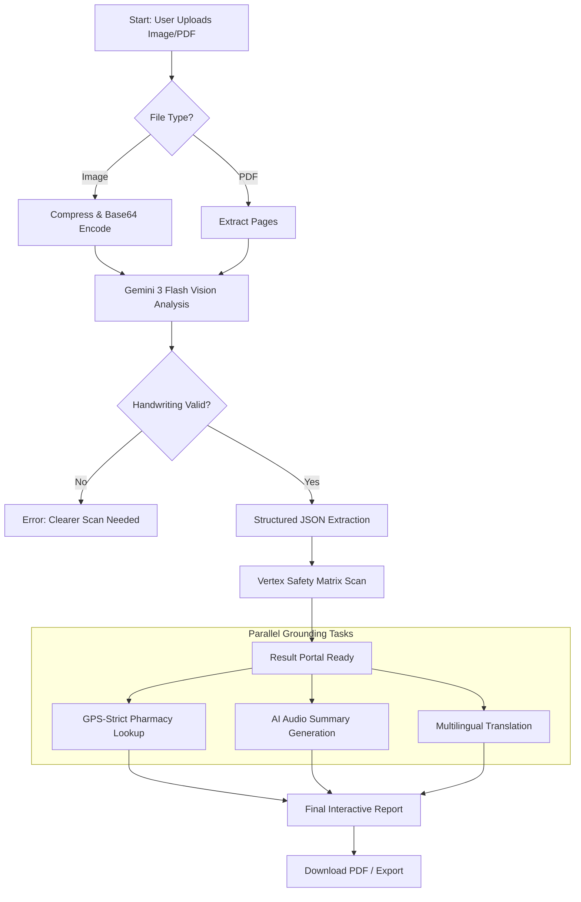
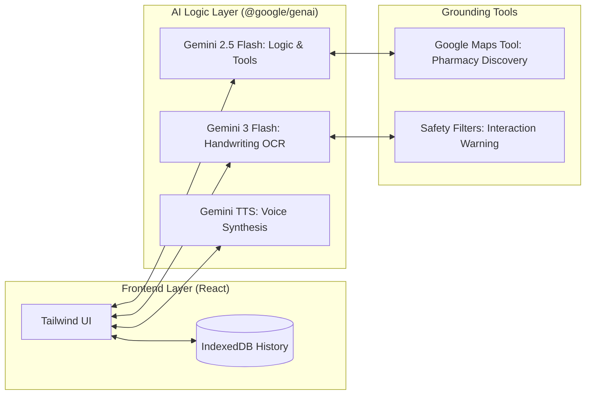

# MediDecode AI: System Architecture & User Workflow

This document provides visual representations of the logic, use-cases, and technical flows within the MediDecode AI platform.

---

## 1. Use-Case Diagram
This diagram illustrates the primary interactions between the **User** (Patient/Caregiver) and the **MediDecode System**.

```mermaid
useCaseDiagram
    actor "User (Patient/Caregiver)" as User
    package "MediDecode AI System" {
        usecase "Upload Prescription/Report" as UC1
        usecase "View Deciphered Handwriting" as UC2
        usecase "Listen to Audio Summary" as UC3
        usecase "Check Drug Interactions" as UC4
        usecase "Find Nearby Pharmacies (GPS)" as UC5
        usecase "Chat with Health Concierge" as UC6
        usecase "Download Clinical PDF" as UC7
    }
    
    User --> UC1
    User --> UC2
    User --> UC3
    User --> UC4
    User --> UC5
    User --> UC6
    User --> UC7

    package "Google AI Services" {
        usecase "Gemini 3 Flash (Vision)" as AI1
        usecase "Gemini 2.5 Flash (Grounding)" as AI2
        usecase "Gemini TTS" as AI3
    }

    UC1 ..> AI1 : <<includes>>
    UC5 ..> AI2 : <<includes>>
    UC3 ..> AI3 : <<includes>>
```

---

## 2. Process Flow Diagram (Technical Sequence)
The step-by-step technical journey of a document from raw upload to a patient-friendly result.



---

## 3. System Architecture (The Google Stack)
A high-level view of the technologies powering the application.



---

## 4. Technical Summary for Developers

| Module | Technology | Purpose |
| :--- | :--- | :--- |
| **Vision Engine** | Gemini 3 Flash | OCR for messy handwriting & shorthand. |
| **Grounding Matrix** | Gemini 2.5 Flash + Maps | GPS-locked verified pharmacy locations. |
| **Voice Layer** | Gemini 2.5 Flash TTS | Converting clinical summaries into audio. |
| **Data Persistence** | IndexedDB | Secure, local storage of scan history. |
| **Export Engine** | html2pdf.js | Client-side professional PDF generation. |

---
*Note: These diagrams are rendered using Mermaid.js. For best viewing, use a Markdown editor that supports Mermaid or view directly on GitHub.*
