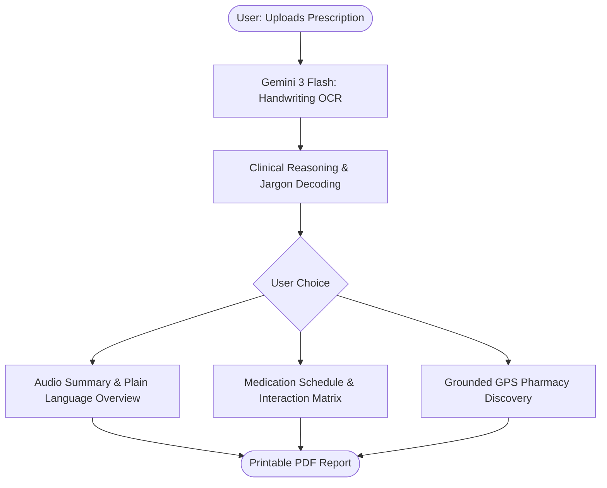
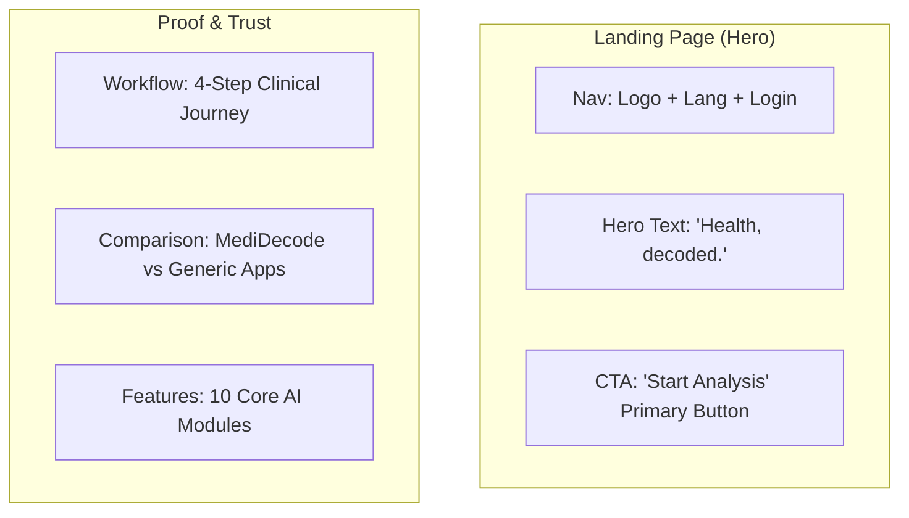
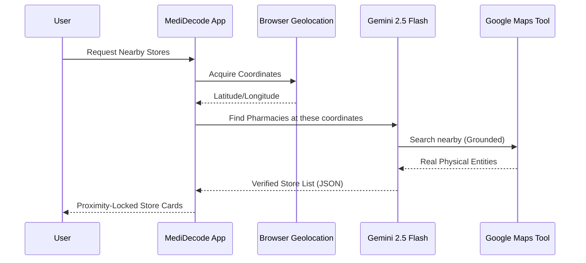

# MediDecode AI: UI/UX Wireframes & Technical Blueprint

This document contains professional blueprints for the MediDecode AI platform. Use these Mermaid diagrams for your PowerPoint presentations by taking a screenshot of the rendered output.

---

## 1. High-Level User Journey
A comprehensive flow of how a patient interacts with the deciphering node.



---

## 2. Landing Page Architecture
The visual layout of the entry portal designed for medical trust.



---

## 3. Analysis Dashboard Wireframe
The core interface where medical decoding happens.

```mermaid
graph LR
    subgraph "Dashboard UI"
    D1[Header: Back to Portal | Download PDF]
    D2[Main Tabs: Overview | Meds | Labs | Safety]
    D3[Content Pane: Interactive Decoded Data]
    D4[Sidebar: Verified Store Finder - GPS Grounded]
    D5[Chatbot: Floating Health Concierge]
    end
```

---

## 4. Technical Grounding Flow
How Vertex AI ensures zero-hallucination for physical pharmacy locations.



---
*Note: These diagrams represent the verified technical architecture of the MediDecode solution.*